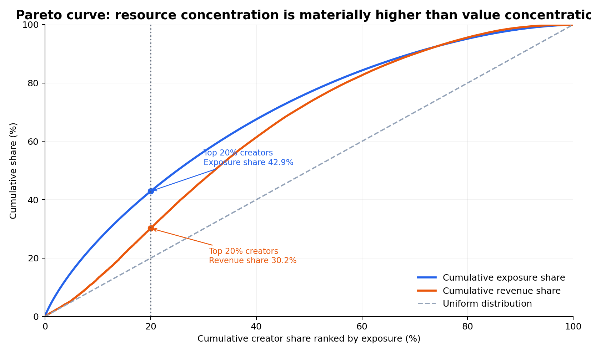
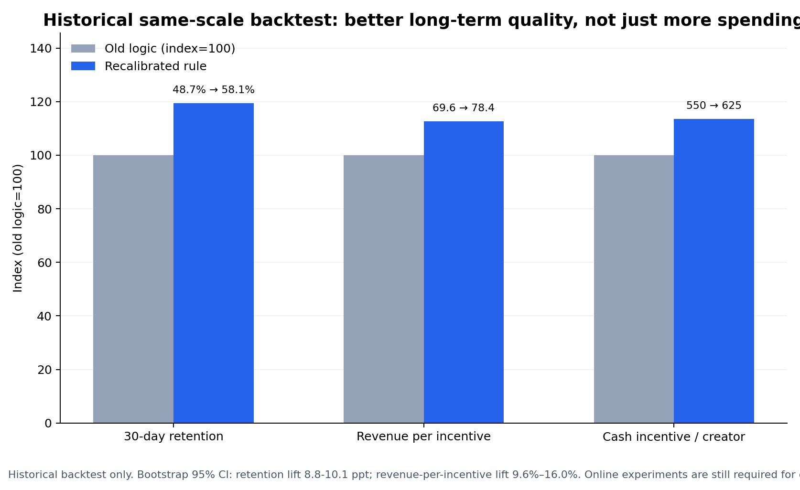

# Creator Value Analysis and Resource Reallocation

[](https://github.com/QILU-622/creator-value-analysis/actions/workflows/tests.yml)

A portfolio case study showing how Python and SQL can be used to diagnose resource misallocation, redesign a creator-prioritisation rule, evaluate it with a fixed-size offline back-test, and define a controlled online rollout.

**Independent portfolio project** · Python · pandas · NumPy · SQL · ranking · offline evaluation · experiment design

[Live project](https://qilu-622.github.io/creator-value-analysis/) · [Technical report](TECHNICAL_REPORT.md) · [Python analysis](analysis.py) · [SQL back-test](sql/resource_reallocation_backtest.sql)

> **Data disclosure:** All data in this repository are synthetic and were created solely for portfolio demonstration. They do not come from an employer, client, production platform, internship, or any confidential source.

## Decision question

When traffic and cash incentives are limited, are resources reaching creators who are more likely to deliver sustained supply and stronger output per unit of support?

The proposed decision rule combines four dimensions:

1. **Sustained supply:** 30-day retention, consecutive active weeks, and stable operating behaviour.
2. **Resource efficiency:** revenue per 1,000 impressions and revenue per unit of incentive.
3. **Supply quality:** monetisation activation and recent operating signals.
4. **Risk controls:** safety, fraud, complaints, migration cost, and operational capacity.

## Key offline back-test results

The comparison holds the selected group constant at the top 4,200 creators.

| Metric | Existing rule | Adjusted rule | Change |
|---|---:|---:|---:|
| 30-day retention | 48.7% | 58.1% | **+9.4 percentage points** |
| Revenue per unit of incentive | 69.6 | 78.4 | **+12.7%** |
| Average cash incentive per creator | 550 | 625 | +13.6% |
| List overlap | — | — | 72.2% |

These are **offline results on synthetic data**, not live business impact. They support testing the rule in a controlled experiment; they do not justify immediate full rollout.

## Selected evidence





Additional robustness, segmentation, and transition charts are available in [`figures/`](figures/), with their underlying result tables in [`outputs/`](outputs/).

## Analytical approach

- Diagnose the creator supply funnel and locate the main loss stage.
- Compare exposure concentration with value concentration.
- Segment creators into actionable groups, including high-exposure/low-monetisation and high-potential/low-incentive cohorts.
- Define safety, fraud, and activity eligibility gates for online implementation.
- Re-rank creators using retention, monetisation efficiency, and resource occupancy signals.
- Compare the existing and adjusted rules at a fixed top-N.
- Define primary metrics, guardrails, rollout thresholds, and rollback conditions for an online experiment.

## What this project demonstrates

- **Decision analytics:** converts a budget-allocation problem into an explicit scoring and selection rule.
- **Evaluation discipline:** compares both rules at the same top-N instead of creating uplift by expanding the selected pool.
- **Management judgement:** balances retention and efficiency gains against higher cash incentives and migration risk.
- **Responsible deployment:** keeps synthetic offline evidence separate from causal online impact and specifies what must be validated next.

## Implementation and verification

| Evidence | What can be inspected |
|---|---|
| Input validation | Required columns, unique creator IDs, binary eligibility flags, non-empty data, and valid pool size fail early with clear errors. |
| Reusable Python | Data loading, scoring, segmentation, and fixed top-N evaluation are separate functions rather than one notebook-only script. |
| Regression tests | Five tests protect the published uplift figures, constant pool size, and key input assumptions. |
| Continuous integration | GitHub Actions runs the analysis and tests on Python 3.11 and 3.12 for every push and pull request. |

## Run locally

```bash
git clone https://github.com/QILU-622/creator-value-analysis.git
cd creator-value-analysis

python -m venv .venv
source .venv/bin/activate        # Windows: .venv\Scripts\activate

python -m pip install -r requirements.txt
python analysis.py
```

The analysis script reads the synthetic CSV inputs in the repository root and prints the fixed top-N back-test summary.

Optional regression checks:

```bash
python -m pip install -r requirements-dev.txt
pytest -q
```

## Repository guide

- [`index.html`](index.html): portfolio overview and decision summary.
- [`analysis.py`](analysis.py): Python implementation of the scoring and fixed top-N comparison.
- [`TECHNICAL_REPORT.md`](TECHNICAL_REPORT.md): methods, assumptions, results, limitations, and next validation steps.
- [`sql/`](sql/): modular SQL for funnel analysis, segmentation, back-testing, transition analysis, and experiment monitoring.
- [`figures/`](figures/): selected diagnostic and robustness charts.
- [`outputs/`](outputs/): committed result tables supporting the published findings.
- [`tests/test_analysis.py`](tests/test_analysis.py): regression checks for the published back-test figures.
- [`.github/workflows/tests.yml`](.github/workflows/tests.yml): automated verification on Python 3.11 and 3.12.
- [`requirements.txt`](requirements.txt): Python dependencies.
- [`requirements-dev.txt`](requirements-dev.txt): optional test dependency.

## Decision boundary

The offline evidence supports a first controlled rollout only. Expansion should require positive primary metrics, stable guardrails, valid randomisation, and no material deterioration in complaints, fraud, safety, or creator churn.
